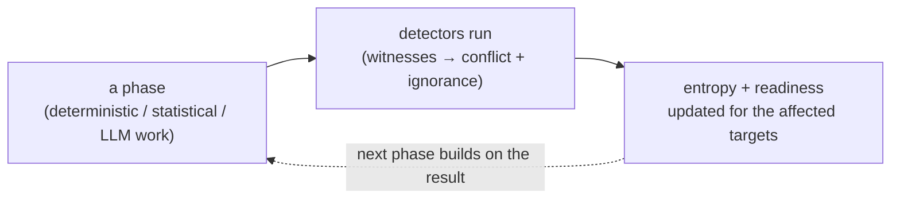

# The approach

DataRaum recovers the meaning latent in an organization's data and binds it to that data.
Two design choices define the approach: it **blends three kinds of method**, and it treats
their **disagreement as the quantity to measure**.

## Why a blend

Each method fails on its own:

- **Schema-only** (read the column names, trust them): names are abbreviated, misleading,
  or mean different things in different sources.
- **LLM-only** (hand everything to the model): the model asserts what a field means with no
  check against the data and no calibrated statement of how sure it is.
- **Statistics-only** (mine the data for patterns): it can establish that two columns
  correlate; it cannot establish that one is a price and the other a discount.

DataRaum uses all three, each where it is authoritative, and checks them against each
other.

| Method | What it does | Authoritative for |
|---|---|---|
| **Deterministic** | Type inference and casting, key detection, relationship and join-path analysis | Exact structure — what the data *is*, mechanically |
| **Statistical** | Profiling, distributions, outliers, Benford's law, correlations, temporal granularity and drift | The *shape* of the data — what its values reveal |
| **LLM** | Field meaning, concept grounding, composing measures / rules / processes | *Meaning* — what the structure and shape represent in the business |

The deterministic and statistical layers are cheap, reproducible, and certain where the
data is certain. The LLM layer supplies the one thing only language understanding can —
meaning — under the constraints of the [closed teach surface](learnable-surface.md) and
the [firewall](measurement.md#the-goodhart-firewall).

## Disagreement is the signal

A field named `created` that never holds a parseable date; a column the model calls an
identifier that the data shows is highly repeated; a join the structure proposes that the
values don't support — each is a disagreement between witnesses, and disagreement marks
where understanding is missing.

For each question worth asking about the data ("is this a date?", "does this token mean
*missing*?", "is this column a stock or a flow?"), several **witnesses** weigh in — one
reading the field name, one reading the data, one reading what you've taught — and a
detector measures how much they **conflict** and how much **ignorance** remains (nobody
qualified weighed in). That combined uncertainty is **entropy**. It is the one measurement
primitive; there is no separate "data quality" score beside it.

This is why no method is trusted alone: a witness that only reads the column name and a
witness that only reads the data can be wrong in the same direction, so at least one witness
per question must read the *data*, not the label. (The framework behind this is recorded in
[ADR-0009](../adr/0009-entropy-as-disagreement.md); the mechanics are in
[measurement & detectors](measurement.md).)

## Phases compose the methods; detectors measure the result

The methods aren't applied in a lump. They're organized into a **pipeline of phases**, each
a focused step — load, type, profile, relate, annotate, enrich, slice, validate — that uses
whichever methods fit its job. After each phase, the relevant **detectors** run and update
the entropy scores, so understanding (and the measure of how much is still missing) builds
up incrementally rather than being computed once at the end.

The phases themselves are covered in [the pipeline](pipeline.md); the stages a *user* walks
through (which group the phases into bigger steps) are [the journey](the-journey.md).

## Constraints on the LLM

Two mechanisms bound the LLM's role in the blend:

- **A closed, typed surface.** The LLM fills in a fixed vocabulary — concepts, measures,
  rules, and a fixed set of *teaches* — and cannot extend it. Its free text is recorded
  alongside a measurement and does not enter the score computation. A correction re-enters
  analysis as one more **witness**, weighed with the others. This is the **Goodhart
  firewall** — see [the learnable surface](learnable-surface.md).
- **Calibration against ground truth.** A detector's reliability is measured: each is run
  against datasets with injected issues and a recorded answer key, and must show recall and
  precision before its signal enters readiness — see
  [measurement & detectors](measurement.md).
