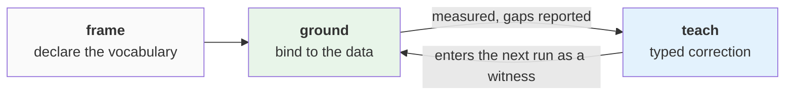

# Frame, ground, teach

Knowledge enters a workspace through three operations: **frame** declares the vocabulary,
**ground** binds it to the data, **teach** corrects it. Corrections feed the next
grounding, which closes the loop.

## Frame

Framing records what the workspace is about: concepts, and the metrics, validations, and
cycles defined over them. You describe this in plain language; the cockpit turns it into
**declared** artifacts — typed entries with a name and a target shape, not yet bound to
data. In storage terms the two halves land differently: **concepts** — a name, a kind, the
column-name patterns that indicate it — are written as rows in the workspace's own
`concepts` table, which the engine reads directly; the **metric, validation, and cycle**
definitions are written as overlay rows the engine folds into its configuration.

Framing happens before import; the engine grounds incoming data against it. A framed
vocabulary can be exported and reused as a
[vertical](learnable-surface.md#verticals-reusable-starting-points) — a shipped vertical
(finance exists today) seeds a workspace with the same artifact types a user would
declare by hand.

## Ground

Grounding is the engine's part: binding each declared artifact to columns, tables, or
views. Names and indicator patterns select candidates; profiling and data evidence decide
the binding. Each artifact ends in one of two states:

- bound, with the evidence and a measured confidence recorded, or
- not bound — it stays declared, and the reason is recorded.

The state sequence — declared → grounded → executed — is described with
[the operating model](operating-model.md#the-lifecycle).

## Teach

A teach is a typed correction: a token that means *missing*, a column's unit, a type
pattern, a relationship the detection missed, a drill-down hierarchy it didn't find. The
set of teach types is fixed — see
[the learnable surface](learnable-surface.md#the-teach-types).

Applying a teach writes one row to the workspace's overlay; the affected stage re-runs
and the measurements are recomputed. Two properties matter in practice:

- **A teach is input, not output.** It changes what the next run reads — an indicator
  list, a null-token set — and enters the measurement pool as one more witness alongside
  the data evidence. It does not write a result or move a score directly; teach appliers
  write to configuration inputs only. The pooling that weighs witnesses is described in
  [measurement & detectors](measurement.md#the-goodhart-firewall).
- **Teaches persist.** They survive re-runs, including a full rebuild of the workspace; a
  re-run reapplies them.

## The loop

Readiness (*ready / investigate / blocked*) marks where measured understanding is weak.
Asking *why* returns the disagreement behind a score and the teach types that would
address it. After a teach, the affected work re-runs and the score is recomputed from the
new evidence.

Declaration, adjudication, and correction are separate operations: users and agents
declare and correct; scores are computed from the pooled evidence. The constraints that
keep these separate are described in [the learnable surface](learnable-surface.md) and
[measurement & detectors](measurement.md).
