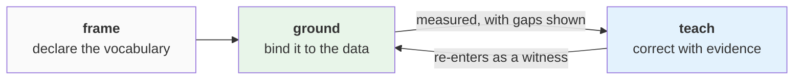

# Frame, ground, teach

Everything DataRaum knows about your organization arrived through one cycle: you **frame**
what should be true, the engine **grounds** it in the data, and you **teach** it where
it's wrong — which re-enters the next grounding as evidence. This page is that cycle: the
three verbs, and why the system is built around them.

## Frame — declare what should be true

Framing turns intent into vocabulary. You describe, in plain language, what your
organization deals in and what you want to understand; that becomes **declared**
artifacts — concepts, and the metrics, validations, and cycles built on them. Declared
means exactly that: named and typed, with a target shape, and *no data backing yet*.

Nothing about your domain is pre-configured. The concepts you frame **are** your
workspace's vocabulary — and a bundle of framed knowledge can be shipped and reused as a
[vertical](learnable-surface.md#verticals-reusable-starting-points), so a domain's
accumulated understanding can seed a new workspace instead of starting from a blank page.

Frame deliberately runs *before* the data is touched. The declaration is the standard the
data gets measured against — not a summary written after the fact to fit whatever was
found.

## Ground — bind it to the data

Grounding is the engine's half: walking the declarations and binding each one to actual
columns, tables, and views. A concept grounds to the columns that carry it; a metric's
extracts ground through concepts to real data; a validation grounds to the columns it
constrains.

Grounding is **earned, not asserted**. A declaration's name and indicators steer where to
look — the data decides what holds. And the outcome is always visible, in both
directions:

- what grounds, grounds with **evidence** and a measured confidence behind it,
- what doesn't stays **declared**, with the reason recorded — *"the data does not support
  this"* is a first-class result, not a silent omission.

The states an artifact moves through — declared → grounded → executed — are the
[operating model's lifecycle](operating-model.md#the-lifecycle).

## Teach — correct with evidence

Grounding will get things wrong, and data needs interpretation no analysis can supply: a
placeholder token that means *missing*, the unit a column is measured in, a join the
engine didn't see, a concept bound to the wrong column. When that happens, you **teach** —
a small, typed correction from a
[closed set of teach types](learnable-surface.md#the-teach-types).

The property that makes teaching safe is the one the whole system leans on: **a teach is
evidence, not an override.** It does not edit a result or move a score. It re-enters the
next run as one more *witness* — weighed against what the data itself says — and the
grounding is re-earned with the new evidence in the pool. You cannot assert the system
into agreeing; you can only give it better evidence. (This is the no-override half of the
**Goodhart firewall**; the other half is
[measurement it can't game](measurement.md#the-goodhart-firewall).)

Teaches are also the most durable thing you create: they persist across every future run.
Re-running a stage — even rebuilding the workspace from scratch — reapplies everything you
ever taught.

## The cycle in motion

In practice the cycle runs as a loop against the readiness signal:

1. the system **measures** what it doesn't yet understand and shows you where
   (*ready / investigate / blocked*),
2. you ask **why** — and get the disagreement behind the score, with the teaches that
   would resolve it,
3. you **teach**, the affected work re-runs, and the score moves — because the
   understanding moved, not because anyone edited a number.

That last clause is the point of the whole shape. Declaration, adjudication, and
correction are kept structurally apart — the human declares and corrects, the data
adjudicates, and nobody (human, agent, or the system itself) can write the conclusion
directly. It is what lets an LLM do the heavy lifting while the result stays something
you can trust.
