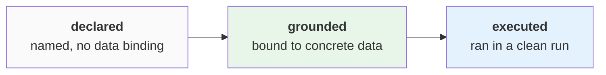

# The operating model

The operating model is the artifact DataRaum produces: the workspace's concepts,
relationships, validations, business cycles, metrics, and driver rankings, bound to the
workspace's data and computed from it. This page describes its parts, its structure, and
the lifecycle its artifacts move through.

## Definitions are computable

Each artifact is stored in a form the engine can execute against the data:

- A **metric** is a dependency graph of extracts, constants, and formulas. It compiles to
  SQL; the SQL is stored with the artifact and can be inspected.
- A **validation** is a rule with executable SQL and a verdict — *passed* or *failed*.
  The verdict is computed from the data at read time, not stored, so it reflects the data
  as it is now.
- A **cycle** is a business process as ordered stages; completion is counted over the
  records that move through them.

Each artifact also carries the confidence of its grounding. A metric that executes
cleanly but has a weakly grounded input is flagged low-confidence, with the reason
recorded. How confidence is measured is covered in
[measurement & detectors](measurement.md).

## Structure

The operating model is a graph. Its central node type is the **concept**: a business term
from the workspace's vocabulary, together with its binding to the columns that carry it.
The term itself is a convention — what the model stores is the mapping and the evidence
for it. The edge types:

- metrics and cycles **reference** the concepts they are defined over,
- a concept **grounds** to columns,
- columns **relate** to each other through confirmed joins,
- a validation **checks** the columns it constrains,
- a **driver** points at the measure whose variation it explains.

Artifacts do not bind to columns directly; the path is artifact → concept → column. When
the data changes, grounding is re-established per concept, and the artifacts referencing
that concept follow without being redefined.

The cockpit's **Model** page renders this graph.

## The parts

**Concepts** — the vocabulary the workspace is described in (*customer*, *invoice*,
*revenue*), each mapped to the columns that carry it.

**Relationships** — joins between tables: detected from value overlap and cardinality,
confirmed semantically, correctable by [teaching](frame-ground-teach.md).

**Validations** — rules the data must satisfy. The verdict is separate from the
artifact's lifecycle state: a validation can be grounded, executing, and failing.

**Business cycles** — processes such as order-to-cash, as ordered stages with completion
measured against the records.

**Metrics** — measures as dependency graphs, compiled to SQL.

**Drivers** — per measure, the dimensions that explain its variation, ranked against a
noise floor computed from the dataset itself. Drivers are not declared; they are computed
during [ingestion](the-journey.md#begin_session).

## The lifecycle

Validations, cycles, and metrics move through explicit states, recorded per run:

- **declared** — created in [frame](the-journey.md#frame): a name and a target shape, no
  data binding.
- **grounded** — bound to concrete columns and views by
  [operating_model](the-journey.md#operating_model).
- **executed** — produced output against the data in a cleanly completed run.

An artifact the data cannot support stays **declared**, and the reason is recorded on the
artifact. It remains visible in that state; it is not removed.

Artifacts are versioned by run: a re-run writes a new version under a new run id, and the
new version becomes visible only when the run completes. A failed or partial run is not
shown.

Lifecycle operations are **stage-authorized**: each operation (declare, bind, compose,
execute, endorse) is permitted only from specific journey stages, and an operation from
any other stage is rejected. The check is fail-closed — a stage not explicitly authorized
is denied. `endorse`, the transition to canonical, is authorized for no stage, so no
artifact can reach canonical regardless of what an agent requests. This is the third
enforcement point of the **Goodhart firewall**, alongside the
[closed vocabulary](learnable-surface.md) and the
[measurement pooling](measurement.md#the-goodhart-firewall).

!!! note "canonical and endorsement are not built"
    The design adds a fourth state, **canonical** — an *organizational* state meaning
    "endorsed as the version we use" — reached through an endorsement workflow. Neither
    the state nor the workflow is implemented today; they live in the
    [vision](../vision/architecture-future.md) only.

## Where it appears

The **Model** page renders the graph. Answers in the Analyse chat resolve against the
operating model and report which artifacts and concepts they used, with the grounding
confidence.
