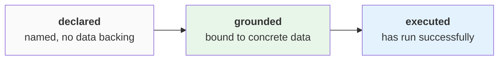

# The operating model

The operating model is what DataRaum exists to produce: the concepts, relationships, rules,
processes, and measures an organization runs on — recovered from its data, bound to that
data, and executable against it. Everything else in these docs serves this artifact. This
page is what it actually is: its parts, its shape, and the lifecycle every part moves
through.

## Executable, not documented

Most organizations have their operating model written down somewhere — a wiki, a metrics
catalog, a diagram. Those documents *describe*; they don't *run*, and nothing tells you
when they stop being true. DataRaum's operating model is executable knowledge: every part
of it is either computed from your actual data or explicitly, visibly not.

Executable means something concrete for each part:

- a **metric** is not a definition in prose; it is a calculation that runs against your
  sources, with the SQL there to inspect,
- a **validation** is not a policy statement; it is a check with a verdict — *passed* or
  *failed* — recomputed from the data when you look, never stored and left to rot,
- a **cycle** is not a process diagram; it is a set of ordered stages whose completion is
  measured in the records themselves.

And each part carries its measured confidence with it. A metric is only as trustworthy as
its weakest grounded input — and it says so, rather than presenting a clean number over a
shaky binding. How that confidence is measured is
[measurement & detectors](measurement.md); that it *cannot be gamed* is the
[Goodhart firewall](learnable-surface.md).

## The shape: concepts are the hub

The operating model is a graph, and its hub is the **concept** — a business term made
real. Everything meets at concepts:

- metrics and cycles **reference** the concepts they are built from,
- each concept **grounds** to the actual columns that carry it,
- columns **relate** to each other through confirmed joins,
- validations **check** the columns they constrain,
- **drivers** point at the measures whose variation they explain.

Artifacts never bind to raw columns directly — the path is always *artifact → concept →
column*. That indirection is what makes the model durable: when the data moves, the
grounding is re-earned per concept, and everything built on the concept follows.

This graph is not an illustration; it is the model itself, and the cockpit's **Model**
surface renders it exactly — concepts in the middle, your real tables and columns on one
side, the declared artifacts on the other.

## The parts

**Concepts** — the vocabulary: what a *customer*, an *invoice*, *revenue* mean here, each
grounded in the columns that carry it.

**Relationships** — how tables fit together: discovered from the data, confirmed
semantically, correctable by [teaching](frame-ground-teach.md).

**Validations** — rules the data must satisfy, each executed as a check with a verdict.
The verdict (*passed* / *failed*) is distinct from the artifact's lifecycle state: a
validation can be fully grounded and executing, and failing — that is the validation doing
its job.

**Business cycles** — the processes the organization runs (order-to-cash, procure-to-pay),
as ordered stages with completion measured against the records that flow through them.

**Metrics** — measures as small dependency graphs: extracts of grounded concepts,
constants, and formulas over them, composed into runnable SQL. A metric's definition and
its execution are the same thing.

**Drivers** — for each measure, the dimensions that actually explain its variation,
ranked against the dataset's own noise floor. Unlike the families above, drivers are not
declared — they are discovered during [ingestion](the-journey.md#begin_session) and ride
along as the model's empirical layer.

## The lifecycle

Model artifacts — validations, cycles, metrics — are not one-shot writes. Each moves
through explicit states, recorded per run:

- **declared** — created from intent in [frame](the-journey.md#frame): a name and a target
  shape, no data backing.
- **grounded** — bound to concrete columns and views by
  [operating_model](the-journey.md#operating_model).
- **executed** — has produced output at least once against the data, with the run
  completing cleanly.

The state an artifact *fails* to reach is as much a part of the model as the state it
holds: an artifact the data cannot support stays **declared**, with the reason recorded —
visibly unmet, never silently absent and never silently invented.

The model is also **run-versioned**: a re-run writes a fresh version and becomes visible
only when it completes cleanly, so what you see is always a whole, consistent model —
never a half-updated one.

!!! note "canonical and endorsement are not built"
    The design adds a fourth state, **canonical** — an *organizational* state meaning
    "endorsed as the version we use" — reached through an endorsement workflow. Neither
    the state nor the workflow is implemented today; they live in the
    [vision](../vision/architecture-future.md) only.

## Where you meet it

The model is built by the [journey](the-journey.md) — framed, grounded, executed — and
from then on it is the thing you work *with*: the **Model** surface renders the graph, and
every answer the Analyse chat gives is grounded in it, carrying the model's confidence
rather than a bare number.
