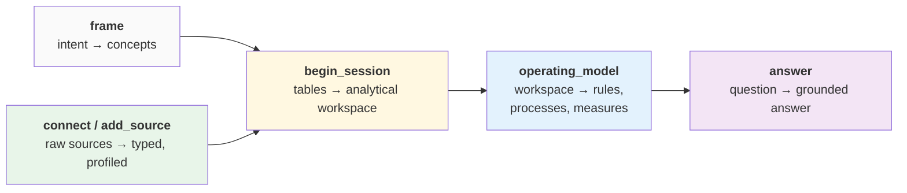

# The journey

The journey is the sequence of stages your data moves through, from raw sources to grounded
answers. Each stage produces an artifact the next one builds on, and each is driven by an
agent with a bounded job and a bounded view of the world.

It is not a strict chain. **frame** and **add_source** are independent upstream stages —
one captures intent, the other brings in data; neither needs the other. They join at
**begin_session**, after which the path is sequential through **operating_model** to
**answer**.

Two things are worth holding onto before the details:

- **Where each stage runs.** The interactive, agentic stages (**frame**, **answer**) run in
  the cockpit. The heavy analysis stages (**add_source**, **begin_session**,
  **operating_model**) run in the engine as durable Temporal workflows. This split is
  deliberate — see [orchestration](../platform/orchestration.md).
- **What persists.** Typed sources, the workspace, and the operating model persist as named
  artifacts. So do your **teaches** — every correction you make survives a stage re-run.
  What does *not* persist is an agent's in-loop reasoning; agents are stateless across runs.

## frame

**Turns intent into a target operating model.** You describe, in plain language, what you
want to understand and decide. The cockpit's agent turns that into two things:

- an **ontology** — the business concepts that matter and how they relate, and
- a **DAG of metrics and validations** built on those concepts — a metric is a dependency
  graph of extracts and formulas, a validation a rule over them, each node depending on the
  concepts (and other nodes) beneath it.

Together they are the *target* operating model: what you want to be true and computable,
declared before any data is touched. Nothing about your domain is pre-configured — the
ontology and DAG you frame *are* your workspace's vertical. Everything here is **declared**:
named, with a target shape, no data backing yet. The stages downstream are what bind it to
the data.

- **Runs in:** the cockpit. **Produces:** a declared ontology + metric/validation DAG,
  written as the frozen grounding contract the engine reads
  ([ADR-0007](../adr/0007-frame-frozen-artifact-contract.md)).

## connect / add_source

**Turns raw sources into typed, profiled, annotated data.** You bring in sources — a
database, an API export, a spreadsheet, a file. The engine loads everything as text (so a
bad value is never a crash), infers types (failed casts go to a quarantine table, not the
floor), profiles each column statistically, and annotates each column semantically against
the framed concepts.

Because it doesn't depend on frame, a source can be added speculatively; once typed and
profiled it joins the workspace's library and is available to any later session.

- **Runs in:** the engine (`add_source`, with a per-table child workflow). **Produces:**
  typed tables + per-column semantics; grounds concepts by binding them to columns.

## begin_session — really *ingest*

!!! note "A name we never fixed"
    `begin_session` is a historical misnomer. What this stage actually does is **ingest**:
    it takes the separately-typed sources and ingests them into *one* analytical model. Read
    the name as "ingest" everywhere.

**Composes typed sources into a single analytical workspace.** `add_source` typed each source
on its own; this stage is where they become one coherent, queryable model. The engine
discovers how tables **relate** (value overlap, cardinality, join paths), classifies them
(fact vs dimension, grain), builds grain-preserving **enriched join views**, identifies the
**dimensions** you can slice by, reconciles measures across tables, and ranks the **drivers**
behind each measure. This is where *many sources become one model*.

It is the most analysis-intensive stage, and the investment pays off: everything downstream
runs cheaply against a well-built workspace.

- **Runs in:** the engine (`begin_session`). **Produces:** relationships, enriched views,
  slice dimensions, driver rankings — the analytical workspace.

## operating_model

**Grounds the framed target in the actual data.** This is the other half of `frame`. Frame
declared *what you want* — the ontology and the metric/validation DAG. `operating_model` is
where that target meets the ingested data: walking the DAG, it **binds** each declared node
(a measure, a rule, a process) to concrete columns and views, then **executes** it — or
reports it as visibly impossible. You get a clear *"the data does not support this measure"*
rather than a silently wrong number.

That reconciliation is the heart of the stage: the frame says what *should* be computable;
the workspace says what the data actually supports; `operating_model` makes every declared
node either executed against real data or honestly marked as unmet. As it goes, each artifact
moves **declared → grounded → executed**, recorded explicitly (see
[the learnable surface](learnable-surface.md)).

- **Runs in:** the engine (`operating_model`). **Produces:** validations, business cycles,
  and metrics — the framed DAG, now bound to data and executed against it.

## answer

**Responds to questions, grounded in the operating model.** You ask in plain language; the
cockpit's agent resolves the question against the operating model — which measure answers it,
which slice narrows it — composes SQL, runs it against the data lake, and returns the result
with the SQL and a confidence behind it. Every number traces back through provenance to a
specific executed artifact, or it is surfaced as ungrounded.

- **Runs in:** the cockpit. **Produces:** answers — SQL, tables, narrative — each tied to the
  artifacts it draws from.

## Going back

Re-entering an earlier stage cascades to the stages built on top of it — re-typing a source
invalidates the workspace and operating model that were built from it. The cockpit shows the
cost before you commit, and because **teaches persist**, a re-run reapplies everything you
previously taught. Going back is a deliberate act with visible consequences, not a silent
reset. How that cascade is actually executed is covered in
[orchestration](../platform/orchestration.md).
