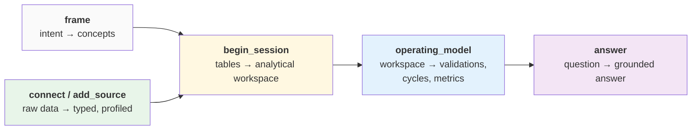

# Overview

This page is the platform at a glance: what DataRaum does, the methods behind it, the
journey your data takes, and the pieces that make it run. Later sections go deep on each;
this one gives you the whole picture in one read.

## The problem

Every organization runs on an **operating model** — the entities it deals in, the processes
it runs, the rules that must always hold, the measures it watches. Usually that model lives
scattered across tools, documents, and people, disconnected from the data underneath it.

DataRaum works on **structured data** — the tables an organization already has across
databases, API exports, spreadsheets, and files — and grounds the operating model back in
it. An LLM already knows the general shape of how organizations work; what it does *not*
know is how **yours** works: which fields carry which meaning, how your sources relate, what
a given value represents, which tables describe the same thing. That knowledge is latent in
the data — it has to be recovered, then bound to the data, not assumed.

The result is an **operating model** that is *executable*: your concepts, processes, rules,
and measures, computed from your actual data with a measured confidence behind each one — and
an LLM kept honest about all of it by a [closed vocabulary it can't escape](#the-approach)
and [measurements it can't game](#how-understanding-is-measured).

## The approach

DataRaum doesn't index schemas and it doesn't hand everything to the LLM. It runs the data
through a **pipeline of phases**, each using the right method for the job, and blends three
kinds of evidence:

- **Deterministic** — exact structure: type inference and casting (failed casts go to
  quarantine, never a crash), key and relationship detection, join-path analysis.
- **Statistical** — what the shape of the data reveals: profiles, distributions, outliers,
  Benford's law, correlations, temporal granularity and drift.
- **LLM** — business meaning: what a column *is*, which concept it grounds, how to compose
  a metric, a validation, or a cycle.

No method is trusted alone. Where they **disagree**, that disagreement is the signal —
which is what the detectors measure (see [measurement](#how-understanding-is-measured)
below and [The approach](../concepts/approach.md) for the full treatment).

## The journey

Your data moves through a sequence of stages. Each stage produces an artifact the next one
builds on, and each is driven by an agent with a bounded job.

- **frame** — you describe what you want to understand; the cockpit induces the *concepts*
  that matter and records them as the grounding target.
- **connect / add_source** — you bring in sources: a database, an API export, a
  spreadsheet, a file. The engine loads everything as text, infers types (failed casts go
  to quarantine, never a crash), profiles each column statistically, and annotates it
  semantically with the LLM.
- **begin_session** — the engine composes your typed tables into an analytical workspace:
  it discovers relationships, builds enriched join views, identifies slice dimensions, and
  ranks the drivers behind each measure.
- **operating_model** — the engine reconciles the framed concepts with what the data can
  actually support, producing **validations**, **business cycles**, and **metrics** that
  are bound to your data and executed against it.
- **answer** — you ask questions in plain language; the cockpit's agent composes SQL
  grounded in the operating model and returns the answer with its provenance.

## How understanding is measured

DataRaum's one measurement primitive is **entropy** — *how much the system does not yet
understand*. Rather than pass/fail quality checks, detectors measure **disagreement
between witnesses**: when the column name says one thing and the data says another, that's
entropy. Scores roll up — through per-intent loss tables — into a **readiness** signal you
can act on:

- **ready** — understood well enough to rely on,
- **investigate** — usable, but with open questions worth a look,
- **blocked** — too uncertain to safely build on.

When something is elevated, the system can tell you *why* and propose a **teach** — a
small, typed correction (a null marker, a type pattern, a concept binding…). You teach,
the engine re-runs the affected work, and the score moves. See
[measurement](../concepts/measurement.md) and the
[learnable surface](../concepts/learnable-surface.md).

## The pieces (in brief)

You only ever touch the **cockpit** — a web app that hosts the chat and renders the
results. Behind it, a durable **engine** does the heavy analysis, and a shared **substrate**
(Postgres, an object store, and Temporal) connects them. Everything happens inside an
isolated **workspace**, which is what makes the platform multi-tenant and cloud-ready.

That's all the architecture you need to use DataRaum. When you want the real picture — the
two-tier split, the substrate, and how a run flows — it's the *leaf* of these docs:
[platform architecture](../platform/architecture.md).

## Next

- [Running the stack](running-the-stack.md) — bring it up locally.
- [The approach](../concepts/approach.md) — how the deterministic, statistical, and LLM
  methods combine across the phases.
- [The journey](../concepts/the-journey.md) — each stage in depth.
