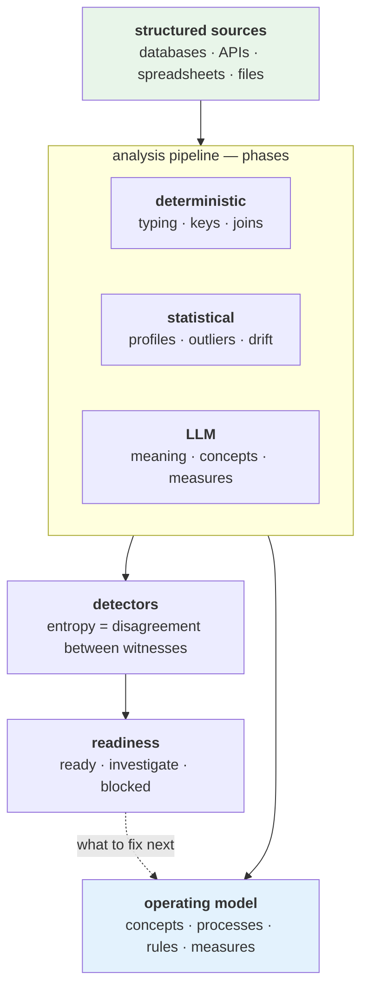

# DataRaum

**Ground your organization's operating model in its own data.** Every organization runs on
an operating model — the entities it deals in, the processes it runs, the rules that must
hold, the measures it watches. That model usually lives scattered across tools, documents,
and people, disconnected from the data underneath it. DataRaum brings the two together: it
turns the structured data an organization already has into an **executable operating
model**, with an LLM held to a closed vocabulary and to measurements it cannot fake.

A semantic layer tells BI tools what columns are *called*. DataRaum learns what they *mean*
— the concepts, relationships, rules, and measures of the organization — and grounds each
one in the actual data, so a definition stops being words in a document and becomes
something computed directly from your sources, with a measured confidence behind it.

## The idea

A modern LLM already knows the general shape of how organizations work. What it *doesn't*
know is how **yours** works: which fields carry which meaning, how your sources relate, what
a given value actually represents, which tables describe the same thing. That knowledge is
latent in the data and the organization. It has to be recovered, then bound to the data —
not assumed.

DataRaum does the recovering and the binding, and produces the operating model as the
durable artifact at the end: the concepts, processes, rules, and measures that used to live
in scattered tools and tribal knowledge, now expressed as something you can run, measure,
and ask questions against.

The deliverable is not a cleaned table or a dashboard. It is that model **plus a measured
account of how well the system comprehends each part of your data** — solid here, shaky
there — carried alongside it, so you always know how far to trust it. That is *data
understanding* in a literal sense, and it is why we call DataRaum an **understanding
layer**: the layer between your data and an LLM that holds what the system understands —
and how well.

## Why you can trust the LLM here

An LLM is what makes grounding an organization this way possible — and an LLM left to its own
devices is exactly what you can't put in charge of decisions that matter. Two mechanisms keep
it honest:

- **A closed vocabulary it can't escape.** The LLM can't invent new *kinds* of claim. It
  works against a small, typed surface — concepts, measures, rules, processes, and a handful
  of *teaches* — and can only fill those in. Even a correction enters as *evidence to be
  weighed*, never as a direct edit to a result: it cannot make a problem disappear by
  describing it. (This is the **Goodhart firewall** — see
  [the learnable surface](concepts/learnable-surface.md).)
- **Measurement it can't game.** The system continuously measures its own uncertainty — as
  **entropy**, the disagreement between independent witnesses — and reports it as a plain
  readiness signal: *ready*, *investigate*, *blocked*. Those numbers aren't vibes; the
  detectors behind them are **calibrated against known ground truth**, so a low score really
  does track usable data and a high one really does mean *look here*. See
  [measurement & detectors](concepts/measurement.md).

The effect is a system that can't make false progress by hiding what it doesn't know.

## How it gets there

DataRaum doesn't index schemas, and it doesn't hand everything to the LLM. It runs the data
through a **pipeline of analysis phases**, each using the right method for the job, and
blends three kinds of evidence:

- **Deterministic** — exact structure: types, keys, the joins between tables.
- **Statistical** — what the shape of the data reveals: distributions, outliers, drift.
- **LLM** — meaning: what a field *is*, which concept it grounds, how a measure is composed.

No single method is trusted on its own. Where they **disagree** — the field's name claims
one thing, the data shows another — that disagreement is the signal the **detectors**
measure, and it's what turns into the readiness you can act on.

## Many sources, one model

Real questions span sources — different systems, exports, and spreadsheets that were never
designed to fit together. DataRaum brings typed sources into one analytical workspace: it
works out how they relate, builds enriched join views, finds the dimensions you can slice
by, and reconciles measures across tables. The operating model is built over that combined
picture, not over one source at a time.

## How you use it

You work in a **workspace** through the web cockpit. Nothing about your domain is baked in:
you describe what you care about in plain language, and DataRaum builds the model with you.
The work happens in three kinds of chat, each pairing an agent with a working canvas:

- **Connect** — bring data in. Assemble an import set (upload files, probe a database),
  **frame** your domain — declare the concepts you care about, or adopt a shipped vertical
  as a head start — and import. An autonomous grounding loop types and re-grounds what it
  can on its own, surfacing only the gaps that need you.
- **Stage** — teach the model what things *mean*, then run an analytical session over the
  typed tables — relationships, dimensions, drivers — and build the operating model
  (validations, cycles, metrics) over the combined picture.
- **Analyse** — ask questions in plain language. Answers come back grounded: the SQL that
  produced them, the concepts they touched, and a confidence you can inspect — never a bare
  number.

Around the chats sit the standing surfaces: the **Model** graph (the operating model as a
navigable graph over your actual columns), **Governance** (the workspace's state of the
union), **Runs** (everything in flight, and what needs you), and **Reports** (a frozen
answer whose SQL re-runs live on every open — and which tells you when the data has moved
under it).

See the [Overview](getting-started/overview.md) for the whole arc, and
[Running the stack](getting-started/running-the-stack.md) to bring it up.

## Where to go next

- **The concept, in depth** — [The approach](concepts/approach.md) (how the methods
  combine), [the journey](concepts/the-journey.md), the
  [pipeline & phases](concepts/pipeline.md), the
  [learnable surface](concepts/learnable-surface.md) (the closed vocabulary), and
  [measurement & detectors](concepts/measurement.md) (entropy, witnesses, calibration).
- **Using it** — [Overview](getting-started/overview.md) and
  [Running the stack](getting-started/running-the-stack.md).
- **Under the hood** — the [platform architecture](platform/architecture.md), the
  [decision records](adr/README.md), and [Deployment](operations/deployment.md) for
  running released images.
- **The design intent** (north-star, not current state) —
  [Architecture (vision)](vision/architecture-future.md).
