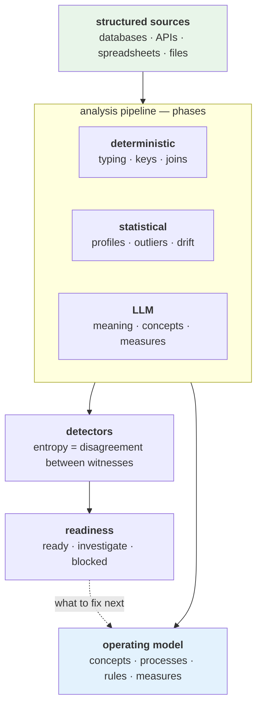

# DataRaum

**Ground your organization's operating model in its own data.** Every organization runs on
an operating model — the entities it deals in, the processes it runs, the rules that must
hold, the measures it watches. That model usually lives scattered across tools, documents,
and people, disconnected from the data underneath it. DataRaum turns the structured data an
organization already has into an **executable operating model**.

A semantic layer tells BI tools what columns are *called*. DataRaum learns what they *mean*
— the concepts, relationships, rules, and measures of the organization — and grounds each
one in the actual data, so a definition stops being words in a document and becomes
something computed directly from your sources, with a measured confidence behind it.

## The idea

A modern LLM already knows the general shape of how organizations work. What it *doesn't*
know is how **yours** works: which fields carry which meaning, how your sources relate, what
a given value actually represents, which tables describe the same thing. That knowledge is
latent in the data and the organization. It has to be recovered, then bound to the data —
not assumed.

DataRaum does the recovering and the binding, and produces the operating model as the
durable artifact at the end: the concepts, processes, rules, and measures that used to live
in scattered tools and tribal knowledge, now expressed as something you can run, measure,
and ask questions against.

The deliverable is the model plus a measured account of how well each part of it is
grounded in the data, carried alongside it. This is why we call DataRaum an
**understanding layer**: it sits between the data and an LLM, and holds what the system
understands about the data — and how well.

## Constraints on the LLM

An LLM supplies the one thing only language understanding can: what fields and tables mean
in business terms. Two constraints bound its role:

- **A fixed vocabulary.** The LLM fills in a typed set of claims — concepts, measures,
  rules, processes, and a fixed set of *teaches* — and cannot add new kinds. Corrections
  enter the next analysis run as evidence, weighed with the rest; they do not edit
  results. (See [the learnable surface](concepts/learnable-surface.md).)
- **Independent measurement.** The system measures its own uncertainty as **entropy** —
  disagreement between independent witnesses, at least one of which reads the data itself —
  and reports it as a readiness signal: *ready*, *investigate*, *blocked*. Detector
  reliabilities are calibrated against datasets with known, injected issues. (See
  [measurement & detectors](concepts/measurement.md).)

## How it gets there

DataRaum doesn't index schemas, and it doesn't hand everything to the LLM. It runs the data
through a **pipeline of analysis phases**, each using the right method for the job, and
blends three kinds of evidence:

- **Deterministic** — exact structure: types, keys, the joins between tables.
- **Statistical** — what the shape of the data reveals: distributions, outliers, drift.
- **LLM** — meaning: what a field *is*, which concept it grounds, how a measure is composed.

No single method is trusted on its own. Where they disagree — the field's name claims one
thing, the data shows another — the **detectors** measure the disagreement, and readiness
is computed from it.

## Many sources, one model

Real questions span sources — different systems, exports, and spreadsheets that were never
designed to fit together. DataRaum brings typed sources into one analytical workspace: it
works out how they relate, builds enriched join views, finds the dimensions you can slice
by, and reconciles measures across tables. The operating model is built over that combined
picture, not over one source at a time.

## How you use it

You work in a **workspace** through the web cockpit. Nothing about your domain is
pre-configured: you describe it in plain language. The work happens in three kinds of chat,
each pairing an agent with a working canvas:

- **Connect** — bring data in. Assemble an import set (upload files, probe a database),
  **frame** your domain — declare the concepts you care about, or adopt a shipped
  vertical — and import. A grounding loop types and re-grounds what it can on its own,
  surfacing the gaps that need you.
- **Stage** — teach the model what things *mean*, then run an analytical session over the
  typed tables — relationships, dimensions, drivers — and build the operating model
  (validations, cycles, metrics) over the combined picture.
- **Analyse** — ask questions in plain language. Answers return with the SQL that produced
  them, the concepts they touched, and the grounding confidence.

Around the chats sit the standing surfaces: the **Model** graph (the operating model as a
navigable graph over your columns), **Governance** (the workspace's overall state),
**Runs** (work in flight, and what needs your input), and **Reports** (saved answers whose
SQL re-runs on open, flagged when the data has changed since the summary was written).

See the [Overview](getting-started/overview.md) for the whole arc, and
[Running the stack](getting-started/running-the-stack.md) to bring it up.

## Where to go next

- **The concept, in depth** — [The approach](concepts/approach.md) (how the methods
  combine), [the journey](concepts/the-journey.md), the
  [operating model](concepts/operating-model.md) (the deliverable itself),
  [frame, ground, teach](concepts/frame-ground-teach.md) (how knowledge enters and
  improves), the [learnable surface](concepts/learnable-surface.md) (the closed
  vocabulary), [measurement & detectors](concepts/measurement.md) (entropy, witnesses,
  calibration), and
  [relationships & aggregation](concepts/relationships-and-aggregation.md) (joins,
  stock vs. flow).
- **Using it** — [Overview](getting-started/overview.md) and
  [Running the stack](getting-started/running-the-stack.md).
- **Under the hood** — the [platform architecture](platform/architecture.md), the
  [pipeline & phases](concepts/pipeline.md), the
  [architecture facts](architecture/README.md), and [Deployment](operations/deployment.md) for
  running released images.
- **The design intent** (north-star, not current state) —
  [Architecture (vision)](vision/architecture-future.md).
