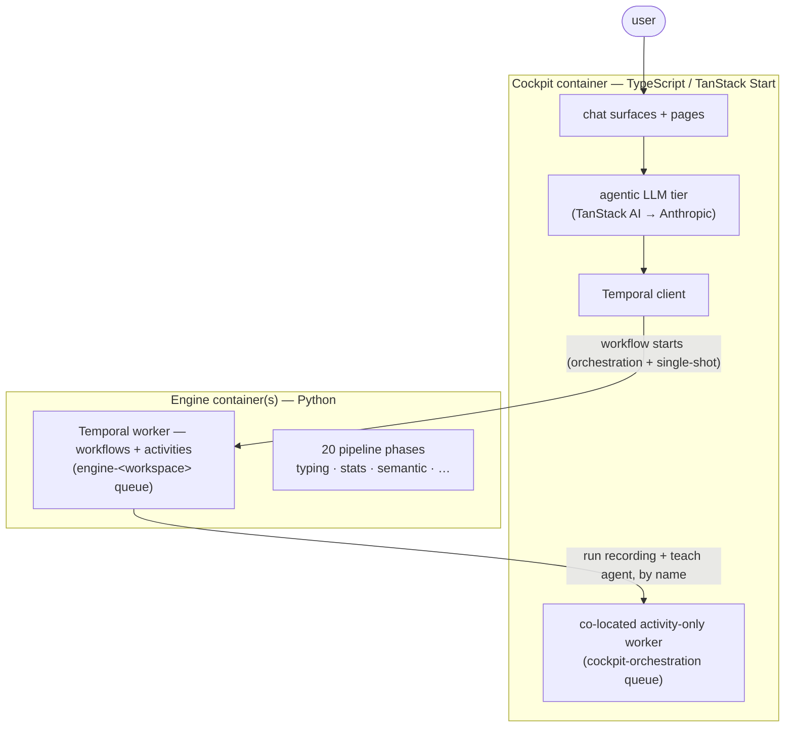
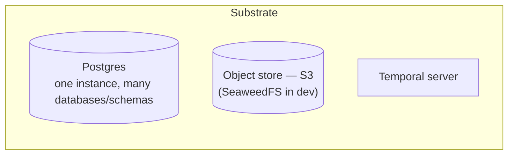
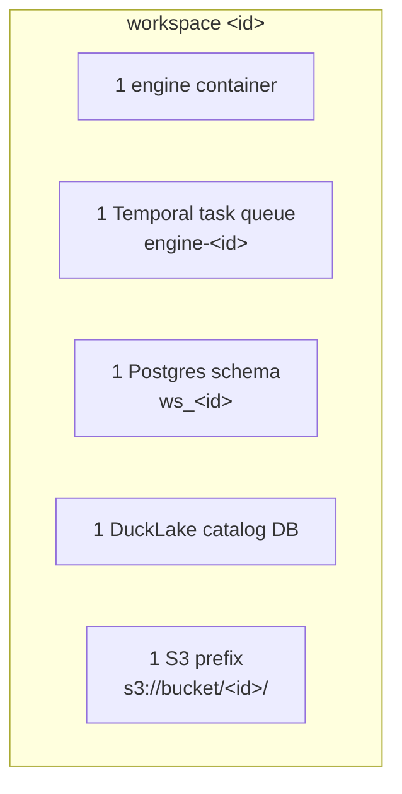

# Platform architecture

DataRaum is a small set of cooperating containers. This page describes how they fit
together: the two workers, the substrate they share, the seam between them, and the
per-workspace model that makes the whole thing multi-tenant.

The decisions behind this shape are recorded as [ADRs](../adr/README.md); this page links
to the relevant one wherever a choice matters.

## The two-tier split

There are exactly two pieces of application code, and the boundary between them is sharp.

- **The cockpit** is the **agentic, interactive tier**. It hosts the chat, the LLM agent
  loop, and all user-facing rendering. It triggers the journey by starting the engine's
  orchestration workflows, and hosts a co-located **activity-only** Temporal worker for
  the control-plane activities (run recording, the grounding-teach agent) those workflows
  call back into. ([ADR-0004](../adr/0004-agent-tier-boundary.md): agentic LLM lives in
  the cockpit; [ADR-0020](../adr/0020-workflows-python-cockpit-activity-only.md): no
  workflow code in the cockpit.)
- **The engine** is the **durable analysis tier**. It is a pure **Temporal activity
  worker** — it has no HTTP server and no API. It runs deterministic, long-running
  analysis and writes the results to Postgres. ([ADR-0002](../adr/0002-engine-no-http-transport.md): engine is a pure activity worker, no HTTP/MCP transport.)

There is **no shared process state** between them. The cockpit and engine talk only
through the substrate: Postgres for metadata, Temporal for work.

## The shared substrate

Three backing services sit under both tiers.

**Postgres** — one instance hosts several logically separate stores
([ADR-0003](../adr/0003-postgres-schema-ownership.md)):

| Database / schema | Owner | Holds |
|---|---|---|
| `ws_<id>` schema | engine (SQLAlchemy) | per-workspace metadata: tables, columns, semantics, relationships, readiness, lifecycle artifacts |
| `ws_<id>_read` schema | engine | the promoted read views the cockpit is allowed to see |
| `cockpit_db` | cockpit (Drizzle) | the cockpit's own state: workspace registry, chat history, UI state |
| `<catalog>` database(s) | engine | one DuckLake catalog database per workspace |
| `temporal` / `temporal_visibility` | Temporal | durable workflow state |

**Object store (S3)** — the data lake lives here, not on a local disk. The engine writes
typed/staged data as parquet under the workspace's lake prefix; file uploads land under an
`uploads/` prefix in the same bucket. In dev this is a single-node **SeaweedFS** S3
gateway; in production it is a real object store with real IAM. (The per-workspace lake
prefix and catalog layout are in
[ADR-0012](../adr/0012-per-workspace-tenancy.md).)

**Temporal** — the durable orchestration backbone. Both workers poll it; it guarantees
long-running analysis survives restarts and is retried correctly.
([ADR-0001](../adr/0001-temporal-orchestration-python.md).)

## The engine↔cockpit seam

Because there is no HTTP between them, the seam is two channels, and only two:

### 1. Work flows through Temporal

The cockpit triggers analysis by starting **engine workflows** by name on the workspace's
task queue. The engine worker bundles three analysis workflows
(`add_source`, `begin_session`, `operating_model`), a per-table child workflow, and the
two orchestration workflows that sequence them (the grounding loop and the session
cascade). The cockpit never runs analysis or workflow code itself; its activity-only
worker serves the run-recording writes and the grounding-teach agent the orchestration
workflows schedule by name. The full orchestration model is in
[ADR-0001](../adr/0001-temporal-orchestration-python.md) and
[ADR-0020](../adr/0020-workflows-python-cockpit-activity-only.md).

### 2. Metadata flows through promoted Postgres views

The cockpit reads engine results straight from Postgres via Drizzle — but **not** from the
engine's raw tables. Engine metadata is **run-versioned**: every phase appends
run-stamped rows, and a terminal *promote* step atomically flips a per-stage head pointer.
Reading "the current state" therefore means joining through that head — a join the engine
materializes once, as a set of generated `current_<table>` **views** in the `ws_<id>_read`
schema. ([ADR-0008](../adr/0008-promoted-read-views.md), [ADR-0010](../adr/0010-failure-contract-idempotent-writers.md).)

The cockpit connects with a dedicated `cockpit_reader` role that has `SELECT` on the read
schema **only**. The raw run-stamped tables are not even visible to it — a stale or
wrong-run read is *unwritable*, not merely discouraged. The cockpit mirrors the view
schema with `bun run db:pull:metadata`, which introspects the views into typed Drizzle
models.

For interactive data reads (the SQL grid, probes), the cockpit attaches the workspace's
DuckLake catalog **read-only** and reads parquet from S3 directly via DuckDB.

!!! info "Cross-package contracts"
    With no codegen, two contracts are maintained by hand on both sides: the **Temporal
    workflow signatures** (the cockpit mirrors the engine's `worker/contracts.py` in
    TypeScript) and the **concept overlay payload** the cockpit writes for the engine to
    ground against ([ADR-0007](../adr/0007-frame-frozen-artifact-contract.md)). Changing
    either is a coordinated edit across both packages.

## The per-workspace model

A **workspace** is the unit of isolation. Everything that belongs to one workspace is
namespaced and never shared with another:

Each workspace runs its **own engine container**, which bootstraps that workspace's
connection manager and DuckLake anchor at startup and polls **exactly** its own queue
(`engine-<id>`). Adding a workspace is, mechanically, a registry row plus one more engine
service. This is what makes the platform horizontally scalable and multi-tenant — see
[Deployment](../operations/deployment.md) for how this maps to running containers and to
the cloud.

The cockpit is a single app that serves all workspaces; it routes each request to the
right workspace's queue, schema, catalog, and lake prefix based on the registry.

## The containers, concretely

A default local stack is:

| Container | What it is |
|---|---|
| `postgres` | the one Postgres instance (all databases above) |
| `seaweedfs` (+ `seaweedfs-init`) | the S3 object store + one-shot bucket creation |
| `temporal` (+ `temporal-admin-tools`, `temporal-create-namespace`, `temporal-ui`) | the Temporal server, schema setup, namespace registration, and web UI |
| `engine-worker` | the engine analysis worker for workspace 1 (one per workspace) |
| `cockpit` (+ `cockpit-migrate`) | the web app + its co-located activity-only worker; migrations run once first |

The engine has **no healthcheck port** — its health is the Temporal worker heartbeat, not
an HTTP probe. See [Running the stack](../getting-started/running-the-stack.md) to bring
this up and [Deployment](../operations/deployment.md) for the full topology and the
per-workspace template.

## Next

- [Decision records](../adr/README.md) — the settled architecture decisions and the *why*
  behind each one.
- [How it works](../concepts/the-journey.md) — the journey and the model behind it.
